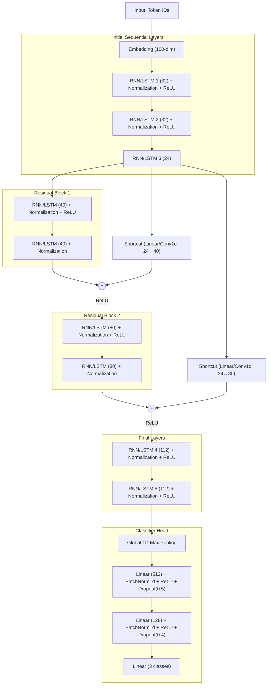

# Model Architecture Deep Dive

This document provides a detailed overview of the various neural network architectures developed for the sentiment analysis project. If you are looking for a quick-start guide and usage instructions, please refer to the [README.md](./README.md).

## Project Overview

The goal of this project is to analyze student feedback and predict sentiments across three classes: **Negative (0)**, **Neutral (1)**, and **Positive (2)**. 

To handle the sequential nature of text data, we implemented and iterated over Deep Residual Recurrent Neural Network (RNN) and Long Short-Term Memory (LSTM) architectures. By combining standard sequential processing with skip connections (Residual Blocks), we alleviate the vanishing gradient problem typically associated with deep networks.

---

## Model Evolution & Performance

We systematically improved our model architecture by tuning normalization strategies, shortcut connection mechanics, gradient constraints, and recurrent cell types. 

Below is the evolution of our models and their performance on the test set:

### 1. Base RNN (`train_rnn.py`)
- **Architecture:** `CustomDeepResRNN`
- **Details:** Uses standard `RNN` layers combined with `BatchNorm1d` for normalization and `Conv1d` layers for sequence shortcut projection. Requires sequence permuting for BatchNorm compatibility.
- **Performance:** 
  - Test Accuracy: **83.26%**
  - Macro Avg F1: **0.70**

### 2. RNN v2 (`train_rnn_2.py`)
- **Architecture:** `CustomDeepResRNN_2`
- **Details:** Replaces `BatchNorm1d` with `LayerNorm` and replaces `Conv1d` shortcuts with `Linear` layers. This makes the architecture much cleaner by removing the need to permute the sequence dimensions back and forth.
- **Performance:** 
  - Test Accuracy: **85.98%**
  - Macro Avg F1: **0.71**

### 3. RNN v3 (`train_rnn_3.py`)
- **Architecture:** `CustomDeepResRNN_3`
- **Details:** Based on the architecture from `train_rnn.py` (with BatchNorm and Conv1d), but introduces **Gradient Clipping** (`grad_clip = 1.0`) during the training loop.
- **Performance:** 
  - Test Accuracy: **88.03%**
  - Macro Avg F1: **0.71**

### 4. RNN v4 (`train_rnn_4.py`)
- **Architecture:** `CustomDeepResRNN_4`
- **Details:** Combines the best of v2 and v3. It uses `LayerNorm` and `Linear` shortcuts while incorporating **Gradient Clipping**.
- **Performance:** 
  - Test Accuracy: **88.44%** *(Best Performing RNN)*
  - Macro Avg F1: **0.74**

### 5. RNN v5 (`train_rnn_5.py`)
- **Architecture:** `CustomDeepResRNN_5`
- **Details:** Builds on `train_rnn_4.py` by lowering the learning rate to `0.0003` to observe stability impacts.
- **Performance:** 
  - Test Accuracy: **86.73%**
  - Macro Avg F1: **0.72**

### 6. Deep Res LSTM (`train_lstm.py`)
- **Architecture:** `CustomDeepResLSTM`
- **Details:** Matches the optimal structural configuration found in `train_rnn_4.py` (LayerNorm, Linear shortcuts, Gradient Clipping), but replaces all `RNN` cells with `LSTM` cells.
- **Performance:** 
  - Test Accuracy: **88.41%**
  - Macro Avg F1: **0.74**

---

## Generalized Architecture Diagram

The models generally follow a pattern of sequential processing followed by deep residual blocks and global max pooling. Below is a representation of the architecture:

---

## Key Architectural Findings

### Layer Normalization vs. Batch Normalization
Transitioning from `BatchNorm1d` to `LayerNorm` (starting in `train_rnn_2.py`) provided a more natural fit for sequence data. Batch Normalization in PyTorch computes statistics across the batch for each feature channel, requiring the sequence tensor to be repeatedly transposed (`permute`). Layer Normalization normalizes across the feature dimension for each token independently, avoiding dimensionality gymnastics and typically resulting in more robust sequence modeling.

### The Impact of Gradient Clipping
One of the largest performance jumps occurred when adding gradient clipping (`grad_clip = 1.0`). Without it, the base RNN model achieved ~83.2% accuracy. Implementing clipping increased accuracy dramatically to **~88%**. This indicates that our deep recurrent stacks were suffering from exploding gradients, and capping them allowed the optimizer to find a much better minimum.

### Vanilla RNN vs. LSTM
Traditionally, LSTMs heavily outperform vanilla RNNs on long sequence tasks because their gating mechanisms explicitly fight vanishing gradients. However, by incorporating **Residual Connections**, **Layer Normalization**, and **Gradient Clipping**, our optimized vanilla RNN (`train_rnn_4.py` at 88.44%) performs functionally identically to the LSTM counterpart (`train_lstm.py` at 88.41%). The structural additions mitigated the standard shortcomings of plain RNNs.
