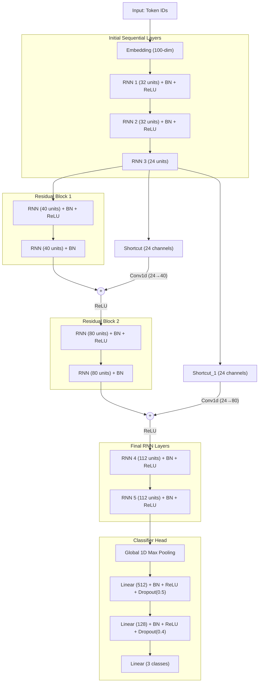

# Sentiment Analysis: Deep Residual RNN

This project analyzes student feedback using deep learning models built with PyTorch. It predicts sentiment across three classes: **Negative (0)**, **Neutral (1)**, and **Positive (2)**.

> [!NOTE]
> **Architecture Deep Dive:** For a detailed look at the evolution of our models, including performance metrics across different normalization and recurrent unit strategies (RNN vs LSTM), please see [ABOUT.md](./ABOUT.md).

## Project Structure

```text
week5_6_student_feedback_analysis_RNN_LSTM/
├── config.py              # Shared paths, hyperparameters (EPOCHS=100, PATIENCE=10)
├── data_pipeline.py       # Data downloading, text cleaning, vocab building
├── train_rnn.py           # CustomDeepResRNN definition & training
├── requirements.txt       # Project dependencies
├── utils/                 
│   ├── training.py        # Training loop with Checkpointing & Early Stopping
│   ├── evaluation.py      # Classification reports, confusion matrices
│   └── plotting.py        # Training history plots
```

## Architecture: CustomDeepResRNN

The core model in `train_rnn.py` has been updated to a `CustomDeepResRNN`. It moves beyond vanilla RNNs by incorporating deep sequence processing, Batch Normalization between time-steps, and Convolutional Shortcut connections (Residual Blocks).



### Key Features
* **100 Epoch Training with Early Stopping:** `config.py` is set to train up to 100 epochs, but `utils/training.py` implements an early stopping mechanism that safely halts training and restores best weights if validation accuracy doesn't improve for 10 consecutive epochs (`PATIENCE=10`).
* **Residual Connections:** Time-distributed 1D convolutions project the dimensionality of sequence shortcuts to match block outputs, preventing vanishing gradients in deep RNN stacks.
* **Global Max Pooling:** Consolidates the final sequence features efficiently before passing to a heavy dense classifier.

## Usage

1. **Install dependencies**:
   ```bash
   pip install -r requirements.txt
   ```

2. **Run the Deep Res RNN pipeline**:
   This single script automatically prepares the data pipeline, trains the model with early stopping, plots validation curves, and performs interactive testing.
   ```bash
   python train_rnn.py
   ```

## Outputs

*   **`checkpoints/custom_deep_res_rnn/best_model.pt`**: The optimal weights retrieved via Early Stopping.
*   **`logs/custom_deep_res_rnn_training_log.csv`**: Historical epoch metrics.
*   **`results/custom_deep_res_rnn/...`**: Training plots, confusion matrix, and classification report.
